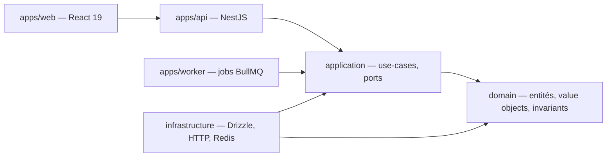

# before-bet

**Des statistiques honnêtes sur un pari précis, avant de le placer.**

Une application d'aide à la décision pour parieurs sportifs. L'utilisateur ne part pas d'un match,
il part d'un **marché de pari** — « plus de 1,5 but sur PSG–Lens », « les deux équipes marquent »,
« Mbappé + de 2,5 tirs cadrés » — et reçoit un dossier statistique complet sur ce pari précis.

---

## Le problème

Les outils de statistiques pour parieurs disent tous la même chose :

> **+1,5 but : 8 des 10 derniers matchs → 80 % ✅**

Trois chiffres, trois problèmes. L'échantillon est trop petit pour dire quoi que ce soit. Aucune
incertitude n'est affichée. Et 80 % n'est comparé à rien — ni à la moyenne du championnat, ni à ce
que la cote propose déjà.

## Ce que fait `before-bet`

```
+1,5 but — PSG vs Lens

Fréquence observée : 78 % sur 41 matchs comparables (IC 95 % Wilson : 63 %–88 %).
Cote 1,28 → probabilité implicite 75 % après retrait de la marge bookmaker (overround 6,2 %).
Écart estimé : +3 pts, non significatif au vu de l'intervalle.

⚠️  12 des 41 matchs se sont joués sans le buteur principal de Lens.
    Sur l'échantillon restreint (29 matchs), la fréquence tombe à 71 %.

Base de référence Ligue 1 2024-25 : 74 % — cette affiche n'est pas atypique.
```

La valeur n'est pas dans le pourcentage. Elle est dans la **taille d'échantillon**, l'**intervalle
de confiance** et les **avertissements**. C'est ce qui permet à l'utilisateur de décider, plutôt que
de se faire confirmer ce qu'il pensait déjà.

Le produit décrit le passé et son incertitude. **Il ne recommande jamais de pari.**

---

## État d'avancement

> 🚧 Projet en construction. Le socle de pilotage est en place ; le code applicatif démarre.

| | |
|---|---|
| Socle de pilotage (domaine, conventions, backlog, agents) | ✅ |
| Monorepo et frontières vérifiées par le lint | `BB-001`, `BB-002` |
| Moteur de marchés et statistiques | `EPIC-05` |
| API et application web | `EPIC-07`, `EPIC-08` |

Le backlog complet et son avancement réel : [`docs/backlog/INDEX.md`](docs/backlog/INDEX.md).

---

## Principes non négociables

Ces règles sont des contraintes de conception, pas des intentions. Plusieurs sont vérifiées
automatiquement par des tests ou par le lint.

1. **Aucun chiffre sans son échantillon ni son incertitude.** Un taux affiché sans `n` ni intervalle
   est un bug produit.
2. **Aucune fuite temporelle.** Une statistique calculée pour un match du 12 mars n'utilise que des
   données connues avant le coup d'envoi. Toute lecture d'analyse est bornée par un `asOf` — exigé
   par le typage, pas par convention.
3. **Une cote n'est pas une probabilité.** `1/cote` inclut la marge du bookmaker. Toute comparaison
   passe par un dévigging explicite, dont la méthode est nommée dans la réponse.
4. **Une règle de résolution est versionnée.** « +1,5 but » = buts du temps réglementaire,
   prolongations exclues. Si la règle change, les statistiques calculées avec l'ancienne version
   deviennent incomparables — et le système le sait.
5. **Traçabilité.** Toute statistique expose sa source, sa période, ses filtres, la version de la
   règle appliquée et sa date de rafraîchissement.

---

## Architecture

Monorepo Nx, architecture hexagonale par bounded context. Le choix de Nx n'est pas cosmétique : les
règles de dépendances sont appliquées par `@nx/enforce-module-boundaries`, donc **un import interdit
casse le lint**. Une architecture qu'un outil fait respecter ne se dégrade pas en silence.



Le `domain` n'importe ni framework, ni ORM, ni client HTTP, ni horloge système. Les décorateurs
NestJS s'arrêtent aux controllers et aux adapters.

### Bounded contexts

| Contexte | Type | Responsabilité |
|---|---|---|
| `catalog` | supporting | Référentiel : compétitions, équipes, joueurs, matchs. Réconciliation des identifiants entre sources. |
| `match-data` | supporting | Faits horodatés d'un match : score, buts, compositions, statistiques. |
| `odds` | supporting | Cotes, historique des mouvements, dévigging, probabilités implicites. |
| `market-analytics` | **core** | Marchés de pari, règles de résolution, fréquences, intervalles de confiance. |
| `brief` | core | Composition du dossier utilisateur, génération des avertissements. |
| `identity` | generic | Comptes, favoris, quotas. |

---

## Stack

**Back** — Node 22, TypeScript strict (ESM), NestJS 11, zod aux frontières, PostgreSQL 17 +
Drizzle, Redis, BullMQ.
**Front** — React 19, Vite, TanStack Router + Query, Tailwind.
**Tests** — Vitest, Testcontainers pour l'intégration, Playwright pour l'E2E critique.

---

## Comment le projet est piloté

Le backlog vit **dans le dépôt**, en markdown versionné : un ticket et le code qui l'implémente
arrivent dans le même commit, et l'historique git raconte l'avancement réel.

```
docs/backlog/
├── README.md    la convention : statuts, Definition of Ready, Definition of Done
├── INDEX.md     le board — généré, jamais édité à la main
├── epics/       9 objectifs produit
└── tickets/     critères d'acceptation en Gherkin, périmètre et hors périmètre explicites
```

```bash
node scripts/backlog.mjs
```

Cette commande régénère le board **et valide le backlog** : epic inexistant, dépendance cassée,
ticket estimé trop gros, ticket prêt sans critères d'acceptation, deux tickets en cours simultanés.
Elle sort en code 1 si le backlog est incohérent, et tourne en CI.

Le développement s'appuie sur trois agents spécialisés versionnés dans
[`.claude/agents/`](.claude/agents) : `po-tech` (découpage et priorisation), `architecte-senior`
(conception et ADR), `dev-senior` (implémentation et tests). Leurs frontières sont explicites —
l'architecte n'écrit pas de code de production, et aucun agent ne clôture un ticket.

Les décisions structurantes sont tracées dans [`docs/adr/`](docs/adr).

---

## Données

Le projet démarre sur des sources ouvertes — [football-data.co.uk](https://www.football-data.co.uk)
pour les résultats et cotes de clôture, [StatsBomb Open Data](https://github.com/statsbomb/open-data)
pour les événements détaillés — avant tout fournisseur payant. Chaque source est encapsulée derrière
un port : en changer ne doit toucher que la couche `infrastructure`.

---

## Cadre légal et jeu responsable

`before-bet` est un outil d'analyse statistique. Il n'est pas opérateur de jeux, ne prend aucun pari
et ne renvoie vers aucun opérateur.

Les paris sportifs sont réservés aux personnes majeures et comportent un risque de dépendance et de
perte d'argent. Aucune statistique, aussi rigoureuse soit-elle, ne rend un pari gagnant : elle décrit
le passé, pas l'avenir.

En France, l'aide et l'information sur le jeu problématique sont disponibles auprès de
[Joueurs Info Service](https://www.joueurs-info-service.fr) — 09 74 75 13 13, appel non surtaxé.

---

## Licence

À définir.
